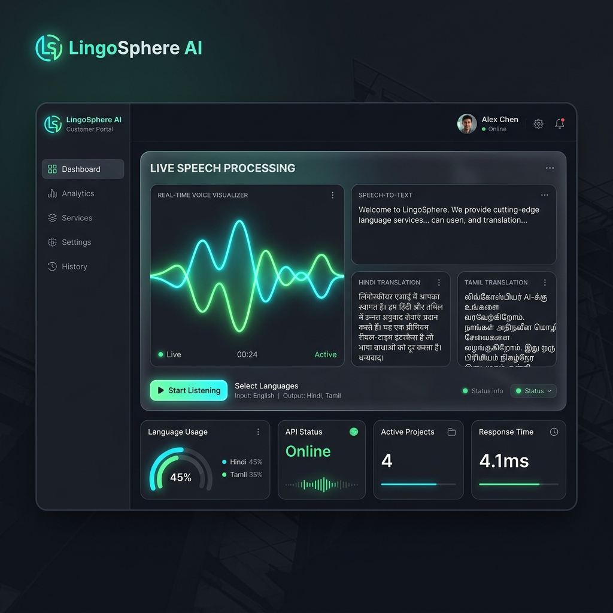
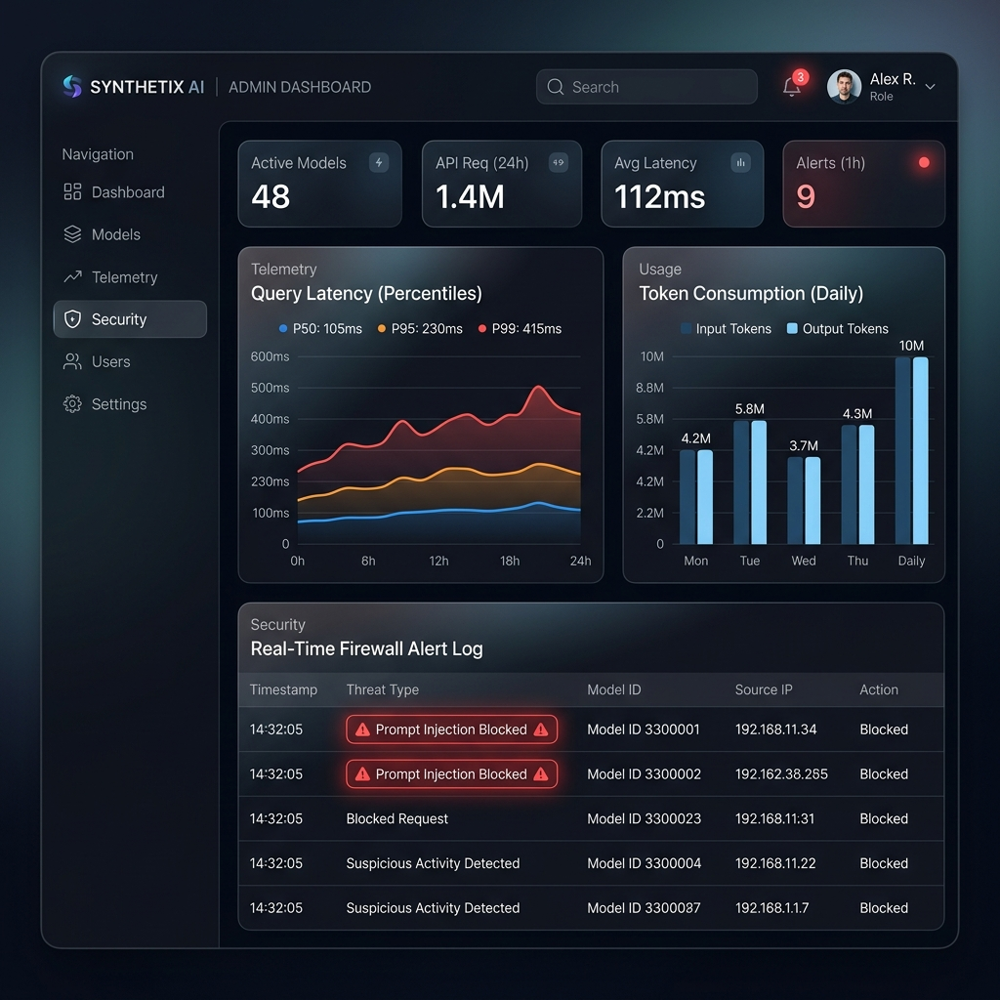

# LingoSphere AI — Startup-Grade Multilingual Assistant Platform


LingoSphere AI is a production-ready, modular, local-language assistant platform built entirely without dependencies on English comprehension. The system supports multi-modal user interactions (voice streaming, chat message history, document parsing, and RAG search query matching) translated into regional scripts and local dialects.

In alignment with production constraints, **Docker is omitted** and standard local execution scripting is provided.

---

## 🛠️ Technology Stack

* **Frontend Customer Portal**: Next.js (TypeScript, Tailwind, PWA) — Port `3000`
* **Admin Control Console**: Next.js (TypeScript, Tailwind) — Port `3001`
* **Backend API Gateway**: FastAPI (Python) — Port `8000`
* **Database & Vector Store**: PostgreSQL / pgvector (Supports automatic local SQLite async fallbacks)
* **Realtime Audio Pipeline**: WebSocket Streaming Audio API

---

## 📂 Monorepo Structure

```
lingosphere-ai-monorepo/
├── apps/
│   ├── web/                   # Customer Portal (Voice UI, settings, accessibility dials)
│   ├── admin/                 # Control Dashboard (Latency tracking, token metrics, firewall logs)
│   └── backend/               # FastAPI Application
│       ├── app/
│       │   ├── core/
│       │   │   ├── config.py  # Environment parsing & key declarations
│       │   │   ├── db.py      # Async DB session handlers (PostgreSQL + SQLite fallback)
│       │   │   ├── models.py  # SQLAlchemy schema mappings & SafeVector implementation
│       │   │   ├── security.py# Prompt firewall, PII redactors, and direct bcrypt hashing
│       │   │   └── agents/    # Multi-Agent engine (Orchestrator, Translator, Planner, Tutor, Cultural Localizer)
│       │   ├── routers/       # Router bindings (auth, chat, voice WS, RAG, admin operations)
│       │   └── main.py        # Gateway entrypoint & lifecycle database seeding
│       ├── tests/             # Pytest unit & integration security tests
│       ├── requirements.txt   # Backend pip packages
│       └── schema.sql         # Raw DDL featuring table range partitioning & pgvector HNSW indexes
├── packages/
│   ├── types/                 # Shared TypeScript interface models
│   └── prompts/               # Shared multi-lingual system instruction templates
├── package.json               # Root workspaces configuration
└── run.ps1                    # PowerShell local launcher & test runner
```

---

## 🖼️ Interface Previews

### Customer Portal
The consumer-facing portal is designed for high-fidelity regional language voice streaming and messaging, featuring automatic speech recognition (ASR), real-time transcription, and context-aware translations.



---

### Admin Control Console
The centralized control console handles system observability, displays real-time telemetry, and triggers security alerts for blocked firewall attempts.



---

## 🛡️ Platform Security & AI Firewalls

LingoSphere AI protects the AI Core against adversarial attacks using layers of defense-in-depth:
1. **Prompt Injection Guard**: Heuristic string analysis scans input queries for override triggers (e.g. *"ignore previous rules"*), blocks requests at the API edge, writes audit logs, and triggers admin dashboard alarms.
2. **PII Sanitizer**: A regular expression engine scrubs emails, phone numbers, and secret credentials before queries are passed to models, reordered to prevent overlapping pattern replacements.
3. **RBAC Control**: Restricts admin metrics endpoints and active feature flag controls strictly to authenticated accounts with `admin` roles.

---

## 📈 System Observability

The backend API automatically tracks and logs:
* Query latency percentiles (`api_latency`).
* Estimated token counts consumed (`token_usage`).
* Word Error Rates for speech synthesis inputs (`asr_wer`).
* Security firewall alert events (`safety_alert`).

---

## 🚀 Quickstart & Verification

To run LingoSphere AI locally on Windows:

### 1. Initialize Environments & Dependencies
Open PowerShell inside the repository directory and run the launcher:
```powershell
.\run.ps1
```
Select Option `[1]` to install Python virtual environments, pip packages, and root Node.js packages.

### 2. Run Test Validations
Select Option `[5]` from the launcher (or run `pytest apps/backend/tests -v`) to execute the integration verification suite.

### 3. Launch Portals
Launch the services in concurrent terminals:
* **Backend API Server**: Select option `[2]` (Port `8000`).
* **Customer Web Portal**: Select option `[3]` (Port `3000`).
* **Admin Control Console**: Select option `[4]` (Port `3001`).

### 🔑 Test Credentials
Use the pre-seeded credentials to bypass registration during development:
* **Email**: `admin@lingosphere.ai`
* **Password**: `adminpass`
